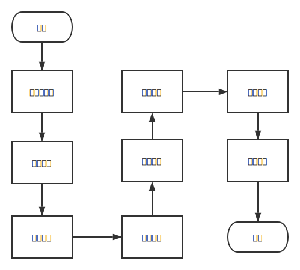
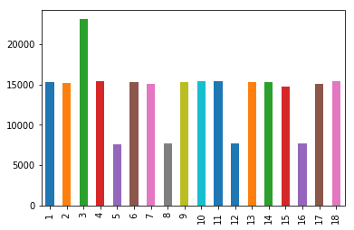

<div align="center">
  <br><br>
</div>

-----------------


| **`Documentation`** |
|-----------------|
| [](http://bigdata.bupt.edu.cn) |


# 北京邮电大学-数据挖掘竞赛-2018
## description

本次比赛是由北京邮电大学、北京师范大学、中国农业大学在2018年5月21到5月27日联合举办，提供了脱敏后真实校园数据用于大赛分析，本次比赛旨在推进智慧校园中大数据分析和应用。

本次比赛采用TensorFlow框架的High Level Api中DNN Regresor，利用GPU加速TensorFlow计算，快速迭代模型。代码解析详情见：https://github.com/sunlanchang/bupt_bigdata_2018/blob/master/bigdata_with_tensorflow.ipynb

## 框架流程图



## 环境

| 环境        | 版本   | Python模块 | 版本 |
| ----------- | ------ | ---------- | ---- |
| Ubuntu      | 16.04  | tensorflow | 1.8  |
| Anaconda    | 5.1    | numpy      |
| Python      | 3.6    | pandas     |
| Jupyter lab | 0.31.5 | matplotlib |

## 数据预处理

- 合并1到10月所有csv文件
- 构造训练数据集
- 对每一个地点的用户ID总数统计，构造标签列。

> 合并文件利用pandas读取每个文件，将每个文件赋值给一个DataFrame，最后利用`pd.concat()`合并成为一个DaraFrame写入文件。

合并的文件如下图所示,共252014行：

| 地点 | 时间 | 人数 |
| -- | -- | -- |
| 12 | 2017-11-28 12 | 11878 |
| 12 | 2017-11-20 12 | 11171 |
| 12 | 2017-11-23 12 | 10740 |
| 12 | 2017-11-21 12 | 10069 |
| ...| ... | ... |

## 提取特征

- 提取已有的基本的特征
- 手工构造特征
- 提取特征列利用pandas对时间特征的解析，分离出日、月、小时等特征列，

| 特征列 |building|cat|day|hour|is_weekend|	loc_id|	month|weekday|
| - | - | - | - | - | - | - | - | - |
|特征列含义|建筑物编号|建筑物类别|日|小时|是否周末|地点ID|月|星期|

## 选择模型

采用`sklearn`和`tensorflow`模型多次训练模型，选择一个模型后优化模型。

- 其中`tensorflow`采用`High Level APIs`中的`Estimator`，快速开发迭代模型取得了较为不错的结果，并且可以灵活的改变神经网络的架构，不需要修改大量的代码。

### Linear Regrassor

- 根据月份将数据可视化后（如下图所示），发现使用线性模型并不适合数据的拟合，训练模型后RMSE值为1000左右也印证了这个结论。



### SVM

- 使用`sklearn.model_selection.train_test_split()`划分数据集为训练数据集和验证数据集，使用`sklearn.svm.SVC()`训练模型。
- 经过累计20小时的训练和预测数据，结果不是很好，RMSE值为800左右。
- 利用`sklearn`的模型有明显的缺点，训练速度太慢，不能快速迭代模型是一个足够放弃这个框架的理由。

### DNN Regrasor

- 采用支持cuda加速并且CPU并行计算的TensorFlow框架让模型迭代的速度有了明显的提升。训练`batch_size`大小为1千万，训练100次也不过用时不到一个小时。
- 经过实际测试隐藏层为4层`[4096, 2048, 1024, 256]`的神经网络在GPU训练速度是CPU的30倍左右。

## DNN超参选择

DNN架构方面尝试了多种不同的架构，利用Tensorboard查看收敛速度，得到一个相对较好的架构（如上所示）

- 受限于GPU显存只有4G，如果隐藏层神经元超过1万，显存溢出，程序无法执行。
- 如果神经网络层数设计的太长同样会出现这个问题。
- 只用三层隐藏层的DNN，隐藏层神经元设计成`[2048,1024,512]`，通过`tensorboard`发现，神经网络收敛的非常快，并且准确率和多一层的架构相差不超过5%。如下图所示：


- 其余超参例如激活函数，学习率，优化算法等采用`tensorflow.estimator.DNNRegrasor()`默认参数。
```
__init__(
    hidden_units,
    feature_columns,
    model_dir=None,
    label_dimension=1,
    weight_column=None,
    optimizer='Adagrad',
    activation_fn=tf.nn.relu,
    dropout=None,
    input_layer_partitioner=None,
    config=None,
    warm_start_from=None,
    loss_reduction=losses.Reduction.SUM
)

```

## 模型训练

- 构建一个收入函数，对模型输入训练数据，训练数据有9/10做模型训练，1/10做模型的交叉验证，验证模型的准确率。
- 模型5000次迭代，20万条数据需要30分钟左右时间，根据`tensorboard` 查看收敛状态，调整神经网络架构。
- `tensorboard`还有待调研，特别是数据的分布等图表可以很好的了解数据本身，从而从数据出发构建模型，调整模型。

## 模型评测

- 构建输入函数，对训练后的模型输入交叉验证数据，做模型准确率的验证。
- 利用1/10的数据做交叉验证，对比多个模型的准确率，收敛时间，确定模型在局部得到一个最优解。

## 模型预测

- 构建输入函数，输入模型等待预测的数据，运行一次模型，模型迭代输出等待预测的数据，可以保存的字典或列表中。

## 其他常用linux命令

```
tmux new-session -t $name 按照名字创建session
```

## For more information

> https://tensorflow.google.cn/